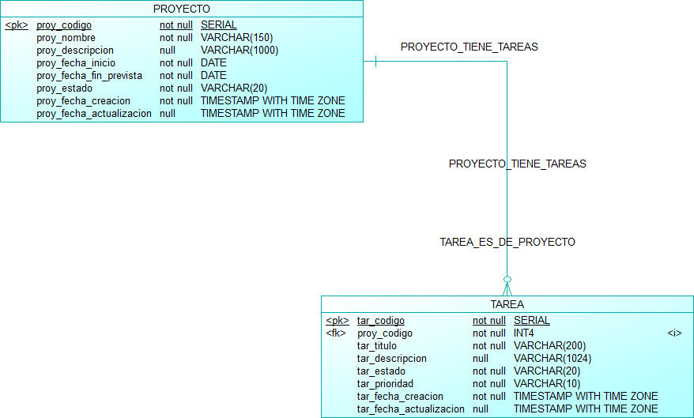
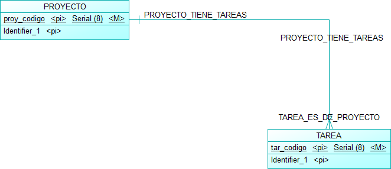
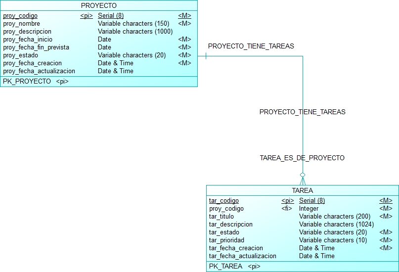

# Gestión de Tareas – Prueba Técnica IDEASGROUP

Aplicación web para crear proyectos y administrar las tareas asociadas a cada uno.
Módulo inicial de una plataforma de gestión de trabajo.

---

## Tabla de contenido

1. [Stack tecnológico](#stack-tecnológico)
2. [Estructura del repositorio](#estructura-del-repositorio)
3. [Requisitos previos](#requisitos-previos)
4. [Instalación y ejecución paso a paso](#instalación-y-ejecución-paso-a-paso)
5. [Variables de entorno](#variables-de-entorno)
6. [Modelo de base de datos](#modelo-de-base-de-datos)
7. [API REST](#api-rest)
8. [Decisiones arquitectónicas](#decisiones-arquitectónicas)
9. [Decisiones no especificadas en el enunciado](#decisiones-no-especificadas-en-el-enunciado)
10. [Pruebas automatizadas](#pruebas-automatizadas)
11. [Uso de asistentes de inteligencia artificial](#uso-de-asistentes-de-inteligencia-artificial)

---

## Stack tecnológico

| Componente | Tecnología |
|---|---|
| Frontend | Angular 17.3 (componentes standalone), TypeScript, SCSS |
| Librería de componentes | **Angular Material 17** con tema propio (paleta "Lavanda y ciruela", estilo glassmorphism, modo claro y oscuro) |
| Configuración frontend | Archivo `.env` leído al compilar con **@ngx-env/builder** |
| Backend | .NET 8, C#, ASP.NET Core Web API (controllers) |
| Persistencia | Entity Framework Core 8 con migraciones incrementales |
| Base de datos | PostgreSQL 16 (Docker) |
| Proveedor EF | Npgsql.EntityFrameworkCore.PostgreSQL 8 |
| Configuración | Variables de entorno (archivo `.env` cargado con DotNetEnv) |
| Documentación API | Swagger / OpenAPI (Swashbuckle) |
| Reporte PDF | **QuestPDF** (licencia Community), generado en el backend |
| Pruebas backend | xUnit + Moq |
| Pruebas frontend | Jasmine + Karma |
| Modelado de datos | SAP PowerDesigner (modelos conceptual, lógico y físico) |

---

## Estructura del repositorio

```
PruTec_IDEASGROUP/
├── .env.example                 ← plantilla de variables de entorno
├── .gitattributes               ← normaliza los finales de línea (LF)
├── docker-compose.yml           ← PostgreSQL 16 para desarrollo
├── BackEnd/
│   ├── global.json              ← fija el SDK de .NET 8
│   ├── GestionTareas.slnx       ← solución
│   ├── GestionTareas.Api/
│   │   ├── Controllers/         ← capa Controller (HTTP)
│   │   ├── Services/            ← capa Service (reglas de negocio)
│   │   ├── Repositories/        ← capa Repository (acceso a datos)
│   │   ├── Entities/            ← entidades del dominio
│   │   ├── Enums/               ← estados y prioridades
│   │   ├── DTOs/                ← contratos de entrada/salida de la API
│   │   ├── Mappings/            ← conversión entidad → DTO
│   │   ├── Exceptions/          ← excepciones de negocio
│   │   ├── Handlers/            ← manejo centralizado de errores
│   │   ├── Reports/             ← diseño del reporte PDF (QuestPDF) y logo embebido
│   │   ├── Data/
│   │   │   ├── AppDbContext.cs
│   │   │   ├── Configurations/  ← mapeo Fluent API al modelo físico
│   │   │   ├── Converters/      ← conversión de enums a texto
│   │   │   └── Migrations/      ← migraciones incrementales generadas por EF
│   │   └── Program.cs
│   └── GestionTareas.Tests/     ← pruebas unitarias (xUnit + Moq)
├── FrontEnd/                    ← aplicación Angular
│   ├── .env.example             ← plantilla de configuración del frontend
│   └── src/
│       ├── assets/              ← logos (versión clara y oscura) e ícono de la pestaña
│       ├── styles/              ← sistema de diseño (tokens, vidrio, tema Material, badges)
│       ├── tests/               ← pruebas unitarias (Jasmine + Karma)
│       └── app/
│           ├── proyectos/       ← modelo, servicio HTTP, formulario y página de proyectos
│           ├── tareas/          ← modelo, servicio HTTP, formulario y página de tareas
│           └── shared/          ← componentes reutilizables, interceptor, validadores, servicios comunes
└── Database/
    ├── diagramas/               ← imágenes de los modelos
    └── powerdesigner/           ← archivos fuente .cdm / .ldm / .pdm
```

---

## Requisitos previos

| Herramienta | Versión | Uso |
|---|---|---|
| [Docker Desktop](https://www.docker.com/products/docker-desktop/) | reciente | Base de datos PostgreSQL |
| [.NET SDK](https://dotnet.microsoft.com/download/dotnet/8.0) | **8.0.x** | Backend |
| Visual Studio 2026 **o** herramienta `dotnet-ef` | — | Aplicar migraciones |
| [Node.js](https://nodejs.org/) | **22 LTS** (probado con 22.18.0) | Frontend |
| npm | incluido con Node.js | Frontend |

> Angular 17 declara soporte oficial para Node 18/20. El proyecto se desarrolló y verificó en
> **Node 22** (desarrollo, build y pruebas), versión indicada para la evaluación.
> No es necesario instalar Angular CLI de forma global: se usa la versión local del proyecto.

---

## Instalación y ejecución paso a paso

### 1. Clonar el repositorio

```bash
git clone https://github.com/4lejoC/PruTec_IDEASGROUP.git
cd PruTec_IDEASGROUP
```

### 2. Configurar las variables de entorno

Copiar la plantilla y, si se desea, cambiar la contraseña:

```bash
# Windows (PowerShell)
Copy-Item .env.example .env

# Linux / macOS
cp .env.example .env
```

El mismo archivo `.env` lo usan Docker (base de datos) y el backend. Ver [Variables de entorno](#variables-de-entorno).

### 3. Levantar la base de datos

```bash
docker compose up -d
docker compose ps        # esperar el estado "healthy"
```

Esto crea un PostgreSQL 16 **vacío** (base `gestion_tareas`). Las tablas se crean en el paso siguiente.

El contenedor debe estar en ejecución siempre que se use la aplicación. Si se reinicia el equipo o se
cierra Docker Desktop, basta con volver a ejecutar `docker compose up -d` (los datos se conservan en el volumen).

### 4. Construir la base de datos con las migraciones

Las migraciones se aplican de forma **explícita** (no al iniciar la API). Elegir una opción:

**Opción A – Visual Studio 2026**

1. Abrir `BackEnd/GestionTareas.slnx`.
2. *Tools → NuGet Package Manager → Package Manager Console*.
3. En *Default project* seleccionar `GestionTareas.Api` y ejecutar:
   ```powershell
   Update-Database
   ```

**Opción B – Consola**

```bash
dotnet tool install --global dotnet-ef --version 8.*   # solo la primera vez
dotnet ef database update --project BackEnd/GestionTareas.Api
```

Ambas ejecutan todas las migraciones **en orden** sobre la base vacía:

| # | Migración | Crea |
|---|---|---|
| 1 | `CrearTablaProyecto` | tabla `proyecto`, PK, checks de estado y fechas |
| 2 | `CrearTablaTarea` | tabla `tarea`, FK con `ON DELETE RESTRICT`, índice, checks |

### 5. Ejecutar el backend

**Visual Studio:** seleccionar el perfil `http` y presionar F5.

**Consola:**

```bash
dotnet run --project BackEnd/GestionTareas.Api --launch-profile http
```

La API queda en `http://localhost:5257` y la documentación Swagger en
**http://localhost:5257/swagger**.

Para comprobar que la API se conecta con la base de datos, abrir **http://localhost:5257/api/status**:
debe responder `"baseDatos": "Conectada"`.

### 6. Ejecutar el frontend

Con el backend en ejecución:

```bash
cd FrontEnd

# Configuración (solo la primera vez)
Copy-Item .env.example .env      # Windows (PowerShell)
cp .env.example .env             # Linux / macOS

npm install
npm start
```

La aplicación queda en **http://localhost:4200**.

### Reiniciar la base de datos desde cero

```bash
docker compose down -v   # elimina el contenedor y los datos
docker compose up -d
# volver a aplicar las migraciones (paso 4)
```

### Problemas frecuentes

| Síntoma | Causa probable | Solución |
|---|---|---|
| La aplicación muestra *"No se pudo conectar con el servidor"* | La API no está en ejecución o el puerto no coincide con `NG_APP_API_URL` | Ejecutar el backend (paso 5) y revisar `FrontEnd/.env` |
| La aplicación muestra *"Ocurrió un error inesperado"* (HTTP 500) | El contenedor de PostgreSQL está detenido (por ejemplo, tras reiniciar el equipo o cerrar Docker Desktop) | Iniciar Docker Desktop y ejecutar `docker compose up -d`. Se puede confirmar con `/api/status` (responde 503 si no hay conexión). El detalle del error se registra en la consola de la API |
| Error `relation "proyecto" does not exist` en la consola de la API | La base de datos está vacía (volumen recreado) | Aplicar las migraciones (paso 4) |
| Error de CORS en la consola del navegador | El origen del frontend no está en `Cors__AllowedOrigins` | Agregarlo en el `.env` de la raíz y reiniciar la API |

---

## Variables de entorno

Todas se definen en el archivo `.env` de la raíz (no versionado). La plantilla es `.env.example`.

### Base de datos (docker-compose)

| Variable | Descripción | Ejemplo |
|---|---|---|
| `POSTGRES_DB` | Nombre de la base de datos | `gestion_tareas` |
| `POSTGRES_USER` | Usuario de PostgreSQL | `gestion_user` |
| `POSTGRES_PASSWORD` | Contraseña del usuario | `cambiar_esta_clave` |
| `POSTGRES_PORT` | Puerto expuesto en el equipo | `5432` |

### Backend (.NET)

| Variable | Descripción | Ejemplo |
|---|---|---|
| `ConnectionStrings__DefaultConnection` | Cadena de conexión a PostgreSQL. Reutiliza las variables de la base con `${...}` | `Host=localhost;Port=${POSTGRES_PORT};Database=${POSTGRES_DB};Username=${POSTGRES_USER};Password=${POSTGRES_PASSWORD}` |
| `Cors__AllowedOrigins` | Orígenes permitidos (URL del frontend), separados por coma | `http://localhost:4200` |

- El doble guion bajo (`__`) equivale a una sección de configuración de .NET
  (`ConnectionStrings__DefaultConnection` → `ConnectionStrings:DefaultConnection`).
- Si una variable ya existe en el sistema, tiene prioridad sobre el valor del `.env`.
- Si falta la cadena de conexión, la API se detiene al iniciar con un mensaje que indica cómo configurarla.

### Frontend (Angular)

Se definen en `FrontEnd/.env` (no versionado). La plantilla es `FrontEnd/.env.example`.

| Variable | Descripción | Ejemplo |
|---|---|---|
| `NG_APP_API_URL` | URL base de la API del backend | `http://localhost:5257/api` |

- `@ngx-env/builder` lee el archivo `.env` al compilar y expone las variables con prefijo `NG_APP_`
  mediante `import.meta.env`. Solo se leen en `shared/api.config.ts`: ningún componente ni servicio
  tiene direcciones escritas a mano.
- Estos valores quedan incluidos en el JavaScript que recibe el navegador, por lo que **nunca deben
  contener secretos** (solo URLs y configuración pública).
- Si la variable no está definida, la aplicación no inicia y la consola del navegador muestra un mensaje
  que indica cómo configurarla.

---

## Modelo de base de datos

Diseñado en SAP PowerDesigner en tres niveles (conceptual → lógico → físico para PostgreSQL).
Los archivos fuente están en `Database/powerdesigner/`.

### Modelo físico



<details>
<summary>Modelo conceptual y lógico</summary>

**Conceptual**



**Lógico**



</details>

### Reglas implementadas en la base de datos

| Regla | Implementación |
|---|---|
| Un proyecto tiene 0..N tareas; cada tarea pertenece a 1 proyecto | FK `fk_tarea_proyecto__proyecto` (obligatoria) |
| No se puede eliminar un proyecto con tareas | FK con `ON DELETE RESTRICT` (además de la validación en el backend) |
| La fecha de fin prevista no puede ser anterior a la de inicio | `CHECK ck_proyecto_fechas` |
| Estados y prioridades con valores fijos | `CHECK` sobre columnas `varchar` |
| Fecha de creación automática | `DEFAULT CURRENT_TIMESTAMP` |
| Consulta eficiente de las tareas de un proyecto | Índice `ix_proyecto_tiene_tareas` sobre la FK |

### Valores permitidos

| Campo | Valores |
|---|---|
| Estado del proyecto | `PLANIFICADO`, `EN_CURSO`, `PAUSADO`, `FINALIZADO`, `CANCELADO` |
| Estado de la tarea | `PENDIENTE`, `EN_PROGRESO`, `BLOQUEADA`, `COMPLETADA` |
| Prioridad de la tarea | `BAJA`, `MEDIA`, `ALTA`, `CRITICA` |

---

## API REST

Documentación interactiva completa en **Swagger**: `http://localhost:5257/swagger`.

### Proyectos

| Método | Ruta | Descripción | Respuestas |
|---|---|---|---|
| GET | `/api/proyectos?nombre=&page=1&pageSize=10` | Listado paginado con filtro parcial por nombre | 200, 400 |
| GET | `/api/proyectos/{id}` | Obtener un proyecto | 200, 404 |
| POST | `/api/proyectos` | Crear proyecto | 201, 400 |
| PUT | `/api/proyectos/{id}` | Actualizar proyecto | 200, 400, 404 |
| DELETE | `/api/proyectos/{id}` | Eliminar proyecto (no permitido si tiene tareas) | 204, 404, **409** |
| GET | `/api/proyectos/{id}/reporte` | Reporte PDF del proyecto y todas sus tareas, descargado como `reporte-proyecto-{nombre}-{fecha}.pdf` | 200 (`application/pdf`), 404 |

### Tareas

| Método | Ruta | Descripción | Respuestas |
|---|---|---|---|
| GET | `/api/proyectos/{proyectoId}/tareas?texto=&estado=&prioridad=&page=1&pageSize=10` | Listado paginado de tareas del proyecto, con búsqueda por texto y filtros por estado y prioridad (opcionales) | 200, 400, 404 |
| POST | `/api/proyectos/{proyectoId}/tareas` | Crear tarea en el proyecto | 201, 400, 404 |
| GET | `/api/tareas/{id}` | Obtener una tarea | 200, 404 |
| PUT | `/api/tareas/{id}` | Actualizar tarea | 200, 400, 404 |
| DELETE | `/api/tareas/{id}` | Eliminar tarea | 204, 404 |

### Estado del servicio

| Método | Ruta | Descripción | Respuestas |
|---|---|---|---|
| GET | `/api/status` | Verifica que la API esté disponible y que pueda conectarse con la base de datos | 200, **503** |

```json
{ "api": "Disponible", "baseDatos": "Conectada", "fecha": "2026-09-26T01:10:00Z" }
```

Si PostgreSQL no responde en 5 segundos (por ejemplo, el contenedor está detenido), devuelve **503**
con `"baseDatos": "Sin conexión"`. Útil para confirmar la instalación antes de abrir el frontend.

### Formato de errores

Todos los errores usan el estándar **ProblemDetails** (RFC 7807):

```json
{
  "status": 409,
  "title": "Conflicto",
  "detail": "No se puede eliminar el proyecto porque tiene tareas asociadas...",
  "instance": "/api/proyectos/1"
}
```

Los errores de validación (400) incluyen además un diccionario `errors` con los mensajes por campo.

---

## Decisiones arquitectónicas

### Base de datos

- **Modelado en tres niveles antes de programar.** El modelo físico sirvió como especificación
  para configurar EF Core; la base **no** se crea con el script de PowerDesigner sino con migraciones.
- **Estados y prioridades como `varchar` + `CHECK`** en lugar de tablas catálogo: son valores
  fijos del dominio; se evitan JOINs y CRUDs innecesarios y en C# se representan como `enum`.
- **Borrado físico** (no lógico): la regla "no eliminar proyectos con tareas" y la FK con `RESTRICT`
  están pensadas para eliminación definitiva. Para "archivar" un proyecto sin perder información
  existen los estados `CANCELADO` y `FINALIZADO`.
- **Extensión del modelo mínimo:** se agregaron `fecha_creacion` al proyecto y `fecha_actualizacion`
  a ambas entidades, con fines de auditoría.

### Backend

- **Arquitectura por capas Controller → Service → Repository** dentro de un solo proyecto,
  separadas por carpetas. Para el alcance del ejercicio, un proyecto por capa no aportaba valor
  adicional. Cada capa depende de la siguiente mediante **interfaces** (inyección de dependencias),
  lo que permite probar los services sin base de datos.
  - **Controller:** solo HTTP (rutas, códigos de respuesta). Sin lógica ni `try/catch`.
  - **Service:** reglas de negocio; lanza excepciones de negocio sin conocer HTTP.
  - **Repository:** acceso a datos con EF Core; sin reglas de negocio.
- **DTOs separados de las entidades:** no se expone el modelo de datos, se evitan ciclos en el JSON
  y el contrato de la API queda estable.
- **Mapeo manual** (métodos de extensión) en lugar de AutoMapper: más explícito y suficiente para dos entidades.
- **EF Core con Fluent API** (clases `IEntityTypeConfiguration`) en lugar de atributos: permite definir
  CHECK, nombres de restricciones, convertidores y comportamiento de la FK, y mantiene las entidades
  libres de detalles de persistencia.
- **Convertidor de enums** (`EnCurso` ⇄ `'EN_CURSO'`): nombres idiomáticos en C# y valores legibles en la base.
  Los `CHECK` se generan desde el propio enum, evitando mantener dos listas sincronizadas.
- **PK `serial`** (`UseSerialColumns()`) para coincidir con el modelo físico.
- **Migraciones incrementales**, una por tabla, revisadas contra el modelo físico antes de aplicarse.
- **Las migraciones no se aplican automáticamente al iniciar la API.** En un entorno real, varias
  instancias podrían intentar migrar a la vez y se ejecutarían cambios de esquema sin control;
  por eso se aplican de forma explícita (`Update-Database` / `dotnet ef database update`).
- **Paginación y filtros resueltos en el servidor** (`COUNT` + `LIMIT/OFFSET`, `ILIKE` para coincidencia
  parcial con escape de comodines), con orden estable y tamaño de página limitado a 100.
- **Validación en tres niveles:** formato en los DTOs (Data Annotations + `[ApiController]`),
  reglas de negocio en los services y restricciones en la base como última línea de defensa.
- **Manejo centralizado de errores** con `IExceptionHandler` (.NET 8) y respuestas `ProblemDetails`.
- **Reporte PDF con QuestPDF en el backend:** el reporte incluye *todas* las tareas del proyecto, no solo la página
  visible, y el servidor ya tiene acceso directo a los datos; generarlo en el navegador obligaría a pedir todas las
  páginas de tareas y a sumar una librería pesada al frontend. `ReporteService` obtiene los datos y
  `Reports/ProyectoReporte` define el diseño: encabezado con logo (embebido en el ensamblado), datos del proyecto,
  resumen por estado y por prioridad con porcentaje de avance, tabla de tareas que continúa en varias páginas
  repitiendo su encabezado, y pie con numeración. Se eligió QuestPDF por su API fluida en C#, sin plantillas HTML
  ni dependencias externas; su licencia Community es gratuita para este uso.
- **Endpoint de estado** (`/api/status`): usa el `DbContext` directamente, sin pasar por Service ni Repository,
  porque es una comprobación de infraestructura y no una operación de negocio. Responde 503 si la base no
  contesta en 5 segundos, en lugar de esperar el tiempo de espera por defecto del proveedor.
- **Configuración externa:** la cadena de conexión y CORS se leen de variables de entorno; ningún secreto
  se versiona. `DotNetEnv` carga el mismo `.env` que usa Docker, de modo que la contraseña se define una sola vez.
- **Fechas:** `DateOnly` → `date` para fechas de negocio; `DateTime` en UTC → `timestamp with time zone` para auditoría.

### Frontend

- **Estructura por funcionalidad:** cada módulo (`proyectos/`, `tareas/`) agrupa su modelo, su servicio
  HTTP y sus páginas; `shared/` contiene lo transversal. Para encontrar algo de tareas, se busca en `tareas/`.
- **Servicios dedicados a HTTP** (`ProyectoService`, `TareaService`) con los métodos GET, POST, PUT y DELETE.
  Los componentes no usan `HttpClient` directamente.
- **Interceptor de errores:** convierte cualquier error HTTP (ProblemDetails del backend, errores de validación
  o servidor caído) en un `ApiError` con un mensaje listo para mostrar. Los componentes no interpretan códigos HTTP.
- **Paginación y filtros en el servidor:** los filtros y la página son *signals*; al cambiar cualquiera se arma
  la consulta y se pide a la API. `switchMap` cancela la petición anterior si todavía no respondió, así nunca
  se muestra una respuesta desactualizada (por ejemplo, al escribir rápido en el buscador).
- **Estados de carga y error:** la primera carga muestra filas de esqueleto; las recargas (cambio de página,
  filtro o tras guardar) muestran una barra de progreso y atenúan la tabla anterior en lugar de vaciarla.
  Si la API falla, se muestra el mensaje con un botón para reintentar. Tras crear, editar o eliminar se vuelve
  a pedir la página actual, para que el orden y los totales sean los que calcula el servidor.
- **Modelos tipados** que reflejan los DTOs del backend; estados y prioridades como tipos literales
  (`'EnCurso' | 'Pausado' ...`), así TypeScript detecta valores inválidos.
- **Configuración por `.env`** con `@ngx-env/builder`, para usar el mismo mecanismo que el backend.
- **Componentes standalone y carga diferida** (lazy loading) de las páginas.
- **Sistema de diseño propio** (`src/styles/`) para evitar el aspecto genérico de Material:
  - *Tokens* como variables CSS (colores, estados, prioridades, radios, sombras, espaciado): un solo lugar para cambiar el estilo.
  - *Glassmorphism* sin degradados: fondo de un solo color con formas geométricas sólidas detrás de superficies
    translúcidas con desenfoque. Diálogos y menús usan vidrio más opaco para asegurar legibilidad, y hay un fondo
    alternativo para navegadores sin `backdrop-filter`.
  - Tema de Angular Material con una paleta propia (ciruela) y tipografía *Plus Jakarta Sans*.
  - Un único patrón de etiqueta (*badge*) para estados y prioridades.
  - Accesibilidad: foco visible con teclado y animaciones desactivadas si el sistema lo solicita.
- **Modo claro / oscuro** (paleta oscura "Ciruela nocturna"): el tema se aplica con un atributo en `<html>` y
  solo redefine los tokens. Recuerda la elección del usuario, respeta la preferencia del sistema si no eligió,
  y se aplica antes de que cargue Angular para evitar parpadeos.
- **Logo de IDEASGROUP** en la barra superior, con una segunda versión para el modo oscuro (el texto gris del logo
  original no se lee sobre fondo oscuro); se muestra una u otra según el tema activo.
- **Navegación en contexto:** las tareas siempre pertenecen a un proyecto (igual que la API), por lo que no hay
  una sección global de tareas. Se accede desde cada proyecto (`/proyectos/:id/tareas`) y se vuelve con migas
  de navegación o el botón volver.
- **Estado de los listados en la URL** (`?nombre=&page=&pageSize=` en proyectos; `?texto=&estado=&prioridad=&page=&pageSize=`
  en tareas): al volver de las tareas, recargar o compartir el enlace se conservan filtros y paginación.
  La URL se actualiza con `Location.replaceState` para no generar navegaciones ni llenar el historial.
- **Descarga del reporte PDF** desde la pantalla de tareas: se pide a la API como archivo (`Blob`) y se descarga con
  una URL temporal, usando el nombre que envía el backend en `Content-Disposition` (expuesto por CORS), así el
  nombre se define en un solo lugar. El botón muestra un indicador mientras se genera y queda deshabilitado para evitar pedidos repetidos.
- **Componentes reutilizables** en `shared/`: etiqueta de estado/prioridad, estado vacío, estado de carga
  (esqueletos), estado de error con reintento, diálogo de confirmación y notificaciones.
- **Formularios reactivos en diálogos** para crear y editar. Solo validan y devuelven los datos; la página que
  los abre decide qué hacer (separación entre presentación y acceso a datos). Validaciones: obligatorios, sin
  textos de solo espacios, longitudes máximas con contador y **validador propio de rango de fechas** (fin ≥ inicio),
  que replica la regla del backend.
- **Filtros de tareas** (opcionales del enunciado): búsqueda por texto en título o descripción, y filtros por estado
  y prioridad combinables. Las búsquedas esperan 300 ms sin escribir (*debounce*) antes de consultar.
- **Fechas y textos en español** (`es-EC`); las fechas se convierten a `YYYY-MM-DD` sin pasar por UTC para
  evitar que se corran un día por la zona horaria.
- **Animaciones:** revelado circular al cambiar de tema, fundido entre páginas, entrada escalonada de filas,
  y microinteracciones en botones y filtros. Todas duran menos de 0,7 s.

---

## Decisiones no especificadas en el enunciado

| Tema | Decisión |
|---|---|
| Estado inicial de un proyecto | `PLANIFICADO` si no se envía |
| Unicidad del nombre de proyecto | No se exige (dos proyectos pueden llamarse igual) |
| Orden del listado de proyectos | Por nombre y luego por código |
| Tamaño de página | Por defecto 10, máximo 100 |
| Tipo de actualización | `PUT` reemplaza todos los campos (incluido el estado) |
| Eliminación | Física; bloqueada si el proyecto tiene tareas (HTTP 409) |
| Formato de enums en JSON | Texto (`"EnCurso"`), no números |
| Fechas de negocio | Solo fecha (sin hora) |
| Filtros y paginación en la interfaz | Se guardan en la URL para conservarlos al navegar, recargar o compartir |
| Tamaños de página en la interfaz | 5 (por defecto), 10 y 20 |
| Tema visual | Claro u oscuro a elección del usuario; por defecto, el del sistema operativo |
| Estado y prioridad iniciales de una tarea | `PENDIENTE` y `MEDIA` si no se envían |
| Cambio de proyecto de una tarea | No permitido: una tarea siempre pertenece al proyecto donde se creó |
| Orden del listado de tareas | De la más reciente a la más antigua |
| Contenido del reporte PDF | Datos del proyecto, resumen de tareas por estado y prioridad, porcentaje completado y detalle de todas las tareas |
| Nombre del reporte PDF | `reporte-proyecto-{nombre}-{AAAA-MM-DD}.pdf`, con el nombre del proyecto sin tildes, eñes ni espacios |
| Búsqueda de tareas por texto | Coincidencia parcial en título **o** descripción |
| Rutas de tareas | Listar y crear dentro del proyecto (`/api/proyectos/{id}/tareas`); obtener, editar y eliminar por código (`/api/tareas/{id}`) |

---

## Pruebas automatizadas

### Backend (xUnit + Moq)

Pruebas unitarias sobre las reglas de negocio de los services. Los repositorios se reemplazan
por *mocks* (Moq), por lo que **no requieren base de datos** ni Docker.

**Ejecutar**

- **Visual Studio:** *Test → Run All Tests* (Test Explorer).
- **Consola:**
  ```bash
  dotnet test BackEnd/GestionTareas.Tests
  ```

| Clase | Prueba | Verifica |
|---|---|---|
| `ProyectoServiceTests` | `EliminarAsync_ProyectoConTareas_LanzaConflictoYNoElimina` | Regla: no se elimina un proyecto con tareas |
| `ProyectoServiceTests` | `EliminarAsync_ProyectoSinTareas_EliminaUnaVez` | Un proyecto sin tareas sí se elimina |
| `ProyectoServiceTests` | `CrearAsync_FechaFinAnteriorAInicio_LanzaValidacionYNoGuarda` | La fecha de fin no puede ser anterior a la de inicio |
| `ProyectoServiceTests` | `CrearAsync_SinEstado_CreaComoPlanificado` | Estado por defecto y limpieza del nombre |
| `ProyectoServiceTests` | `ObtenerPorIdAsync_ProyectoInexistente_LanzaNoEncontrado` | Un código inexistente produce "no encontrado" |
| `TareaServiceTests` | `CrearAsync_ProyectoInexistente_LanzaNoEncontradoYNoGuarda` | Toda tarea debe pertenecer a un proyecto existente |
| `TareaServiceTests` | `CrearAsync_SinEstadoNiPrioridad_AsignaPendienteYMedia` | Valores por defecto de la tarea |
| `ReporteServiceTests` | `GenerarReporteProyectoAsync_ProyectoInexistente_LanzaNoEncontrado` | Un proyecto inexistente produce "no encontrado" y no consulta tareas |
| `ReporteServiceTests` | `GenerarReporteProyectoAsync_ProyectoConTareas_DevuelveUnPdf` | Se genera un PDF válido (firma `%PDF`) con QuestPDF y el nombre del archivo |
| `ReporteServiceTests` | `NombreArchivo_NombreConTildesYSimbolos_GeneraNombreNormalizadoConFecha` | El nombre del archivo queda sin tildes, eñes ni espacios, con la fecha al final |

### Frontend (Jasmine + Karma)

Pruebas unitarias de la lógica que no depende de la interfaz. Las peticiones HTTP se simulan con
`HttpTestingController`, por lo que **no requieren el backend** en ejecución.

Todas las pruebas están en `FrontEnd/src/tests/`, separadas del código de la aplicación.

**Ejecutar** (desde `FrontEnd/`, con el archivo `.env` creado en el paso 6):

```bash
npm test                     # modo interactivo (vuelve a ejecutar al guardar)
npm test -- --watch=false    # una sola ejecución
```

| Archivo | Prueba | Verifica |
|---|---|---|
| `rango-fechas.validator.spec.ts` | Fin anterior a inicio | Marca el error `rangoFechas` (misma regla que el backend) |
| `rango-fechas.validator.spec.ts` | Mismo día con distinta hora | Compara solo la fecha, no la hora |
| `rango-fechas.validator.spec.ts` | Falta una fecha | No duplica el error de campo obligatorio |
| `error.interceptor.spec.ts` | Status 0 | Mensaje de "no se pudo conectar con el servidor" |
| `error.interceptor.spec.ts` | 400 de validación | Une los mensajes por campo y los conserva en `errores` |
| `error.interceptor.spec.ts` | 409 con ProblemDetails | Muestra el `detail` enviado por el backend |
| `error.interceptor.spec.ts` | Error sin cuerpo | Mensaje por defecto según el código HTTP |
| `error.interceptor.spec.ts` | Petición real con error 404 | El componente recibe un `ApiError`, no un `HttpErrorResponse` |
| `proyecto.service.spec.ts` | `listar` con filtro | Método GET y parámetros `nombre`, `page`, `pageSize` |
| `proyecto.service.spec.ts` | `listar` sin búsqueda | No envía el parámetro `nombre` vacío |
| `proyecto.service.spec.ts` | `descargarReporte` | Pide `/proyectos/{id}/reporte` como archivo (`Blob`) y toma el nombre del encabezado `Content-Disposition` |
| `proyecto.service.spec.ts` | `eliminar` | Método DELETE sobre `/proyectos/{id}` |
| `app.component.spec.ts` | Creación y nombre en la barra | La aplicación arranca y muestra su título |

---

## Uso de asistentes de inteligencia artificial

Se utilizó **Claude (Anthropic)** como asistente durante el desarrollo, en las mismas condiciones
que en el trabajo diario:

| Área | Uso |
|---|---|
| Backend | Generación de código base de entidades, configuración de EF, manejo de errores, endpoint de estado, reporte PDF y pruebas unitarias |
| Frontend | Generación de código base de modelos, servicios HTTP, interceptor, configuración por `.env`, sistema de diseño, páginas, formularios, conexión con la API y pruebas unitarias; propuestas de paletas de color |
| Documentación | Redacción de este README y de los comentarios XML de Swagger |
| Revisión | Diagnóstico de errores durante el desarrollo, revisión visual del diseño con capturas y verificación de que los archivos versionados coincidan con el repositorio |

Todas las decisiones fueron revisadas y validadas por el autor, y varias se tomaron en contra de la
sugerencia inicial del asistente (por ejemplo: todo el modelado de la base de daots, un solo proyecto de API en lugar de uno por capa,
mantener el formato de solución `.slnx`, **no** aplicar migraciones automáticamente al iniciar,
estructura del frontend por funcionalidad, configuración con `.env` en lugar de archivos `environment`,
un único `.gitignore` en la raíz, pruebas del frontend reunidas en una carpeta propia,
y la elección de la paleta de colores).
